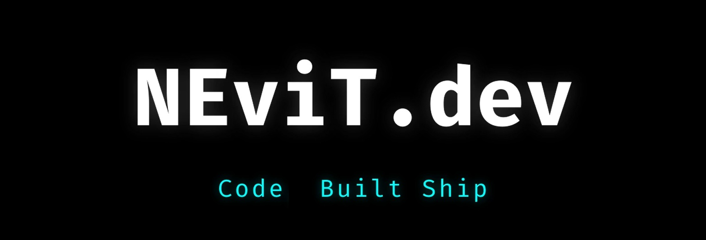

<h1 align="center">Hey, I'm Bryan 👾</h1>

  Software Engineering student · Dev in progress · Costa Rica

  

  <em>7 semesters down, 1 to go — building things along the way.</em>

---

## 🕹️ Currently building

### [Factory Mind](https://github.com/nevitdev/FactoryMind) *(in development)*
A Unity game programmed in C#. Still early, but it's shipping.

---

## 🧰 Tech stack

**Languages I use**
`Python` · `JavaScript` · `C#` *(learning)* · `PHP` · `SQL` · `HTML/CSS`

**On the roadmap**
`Azure` · Certification courses for the stack above

---

## 📌 What's coming to this profile

I'm actively building projects to publish here. On the list:

- REST API with Python / FastAPI
- Personal portfolio (HTML · CSS · JS)
- More Unity / C# experiments from Factory Mind

---

## 🎓 Background

- 4th year, Software Engineering — Universidad Internacional de las Américas (UIA)
- Graduating **2027**
- Working in tech while studying — trilingual (ES · EN · FR)

---

## 📫 Let's connect

  <a href="www.linkedin.com/in/ing-bryan-rodriguez">LinkedIn</a> ·
  <a href="mailto:nevitdev7@gmail.com">Email</a>

